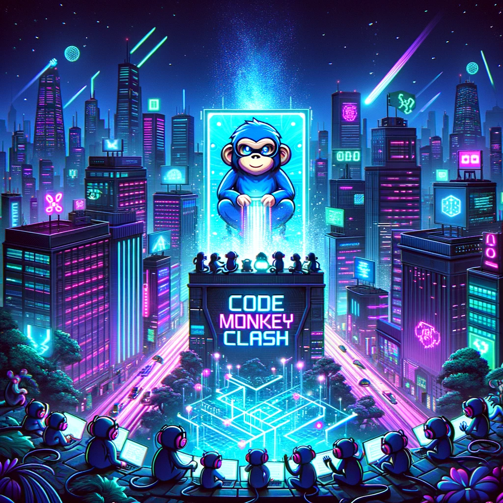

# Code Monkey Clash



Code Monkey Clash is a code competition game where players compete to solve programming challenges.
It is inspired by the <a href="https://github.com/rchatley/extreme_startup">Extreme Startup</a> workshop.
The code is implemented using Bun, TypeScript, ElysiaJS, HTMX, and Tailwind CSS with DaisyUI.
Feel free to use it for your own code competition or to learn about the technologies used.

## Running server

You can run from source with [bun](https://bun.sh):

```sh
git clone git@github.com:snorremd/code-monkey-clash.git
bun install
bun run dev
```

### Docker

You can also run the server with Docker:

```sh
git clone git@github.com:snorremd/code-monkey-clash.git
docker build -t code-monkey-clash .
docker run -p 3000:3000 code-monkey-clash
```

## Screenshots

You can see a visual overview of the game in the [SCREENSHOTS.md](./SCREENSHOTS.md) file.


## Development

```sh
bun install
bun run dev
```

### Running tests

Tests are written using [Bun's own test framework](https://bun.sh/docs/test/writing).
It emulates the Jest API, so it should be familiar to most frontend developers.
Run tests with:

```sh
bun run test
```

### Format, lint, and code check

This project uses [Biome](https://biomejs.dev) for formatting, linting, and code checking.
Before contributing make sure to run Biome formatting and code checks:

```sh
bun run format # Formats the code according to project settings
bun run check # Runs autofixable checks
bun run lint # Runs non-autofixable checks, fix them manually
```

Biome has [multiple editor extensions](https://biomejs.dev/guides/integrate-in-editor/) to help you format and lint your code as you write it.

### Benchmarking

To run benchmarks, use the following command:

```sh
bun run benchmark
```

It will run benchmarks for some of the core functions and endpoints.
Benchmarks are written using [mitata](https://github.com/evanwashere/mitata).

### Running simulation of game

It can be cumbersome running simulations with multiple player servers, so a convenience script is provided:

```sh
# Run simulation with default number of players
bun run simulation

# or with a specific number of players
bun run simulation 10
```

The simulation script does the following:
- Starts the game server on port 3000
- Starts a configurable number of players on port 3001, 3002, ...
- Automatically signs each player up for the game
- Opens the game admin page in the browser

There are currently three types of players under `./example-players`:
- expert
- intermittent-offline
- not-all-answers

The simulation script equally distributes the players among the three types.
Feel free to contribute more player types to make the simulation more interesting.


## Technical Decisions

This project is mostly done for fun and to learn new things, so I've decided to use a few technologies that I'm not very familiar with.
Bun, ElysiaJS, htmx and DaisyUI are all new to me, so I'm excited to see how they work in practice.

For this project I wanted to keep things a bit old-school and use a web oriented, server-side rendered approach.
So instead of doing a SPA with a REST API I opted to implement a traditional web server with endpoints returning HTML.
To give the UI some interactivity I've added [htmx](https://htmx.org/) to the mix.
It is a lightweight library that allows you to add AJAX functionality to your web pages without having to write JavaScript.
This way I can keep the server-side rendering and still have some interactivity in the UI where needed.
Most of the UI should work without JavaScript, but for live log and graph updates users will have to enable JavaScript for htmx to work.

I love TypeScript so for the server I've settled on using [ElysiaJS](https://elysiajs.com/), a fast web framework that runs on [Bun](https://bun.sh).
Bun gives me a performant JavaScript runtime and the ability to use TypeScript without any additional build tools.
ElysiaJS is inspired by frameworks like Express, but has superb TypeScript support and a focus on performance.
The game server will be implemented as a simple ElysiaJS server where state is managed in-memory for simplicity.
To make things more robust, serialization and deserialization of state will be implemented so that the server can be restarted without losing state.

### Web Components for certain live updates

While almost all of the UI is server-side rendered, and then updated using htmx requests, some parts of the UI will be updated on the client side.
This includes things like the game and round timers and the score graphs.
For these parts I'm implementing simple Web Components that can be updated in real-time using client side JavaScript.
While this is a bit of a departure from the server-side rendered approach, it is necessary to avoid spamming the server with requests.
Asking the server to count up the time every second is not a good use of resources, so the client will handle these updates.

### Styling with Tailwind CSS and DaisyUI

For styling I'm going for familiar technology, namely [Tailwind CSS](https://tailwindcss.com/).
This time however I'm opting to use a CSS component library on top called [DaisyUI](https://daisyui.com/).
DaisyUI provides pre-defined components like buttons, inputs, etc that use the Tailwind CSS utility classes under the hood.
This way I get components with consistent look and feel while still having the flexibility of Tailwind CSS with a consistent look and feel.
The style I'm aiming for is a neon-futuristic look with dark background and bright neon colors.

### Bun workers for player handling and state management

Bun, like other JS runtimes, run all work in a single thread by default.
This is fine for most web servers where timing is not critical, and you can scale horizontally to handle more requests.
In this game however, timing is critical, and we need to handle multiple players concurrently.

This issue is solved by running each player's game loop in a separate worker.
The worker runs the game loop as an interval and communicates with the main thread using messages.
No matter how much work the main thread has, the worker will run at the same interval and keep the game running smoothly.

A separate worker thread is also used to persist the game state to disk.
This way we can block the write operation to guarantee atomic writes, without blocking the game loop or the server.

### Real-time communication with server-sent events

For events and real-time communication server-sent events will be used.
This is a simple and efficient way to push events from the server to the client without having to deal with WebSockets.
Using HTMX extensions for SSE the client can listen for events and update the UI accordingly.

## Aknowledgements

This code competition game is inspired by the [Extreme Startup](https://github.com/rchatley/extreme_startup) workshop I first played over ten years ago.
Instead of adding questions to the existing game I wanted to take the opportunity to learn some new technologies and build a new game from scratch.
The mechanics are mostly the same as the original workshop, but will differ in some aspects.
Questions are also made from scratch to provide new challenges for participants who played the original game.

The new game does keep important aspects of the original game.
Questions are encoded as plain old strings and communicated via simple HTTP requests to allow various programming languages to more easily participate.
The questions are not too complex and should be solvable in a few lines of code.
Each player should have a sliding window of progressively harder questions to solve so that the game is accessible to beginners and challenging to experts.


## License

This project is licensed under the MIT License - see the [LICENSE](LICENSE) file for details.